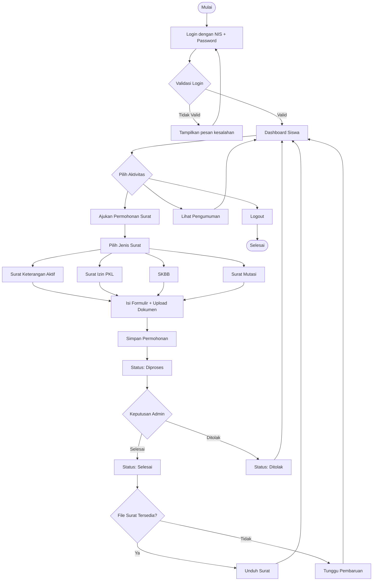

# Activity Diagram Siswa

Diagram ini memvisualisasikan alur aktivitas siswa: login dengan NIS dan password, pengajuan permohonan surat, pemantauan status, hingga logout.

```mermaid
flowchart TD
    A([Mulai]) --> B[Login dengan NIS + Password]
    B --> C{Validasi Login}
    C -- Tidak Valid --> D[Tampilkan pesan kesalahan]
    D --> B
    C -- Valid --> E[Dashboard Siswa]

    E --> F{Pilih Aktivitas}
    F --> G[Ajukan Permohonan Surat]
    F --> H[Lihat Pengumuman]
    F --> I[Logout]

    G --> J[Pilih Jenis Surat]
    J --> J1[Surat Keterangan Aktif]
    J --> J2[Surat Izin PKL]
    J --> J3[SKBB]
    J --> J4[Surat Mutasi]

    J1 --> K[Isi Formulir + Upload Dokumen]
    J2 --> K
    J3 --> K
    J4 --> K

    K --> L[Simpan Permohonan]
    L --> M[Status: Diproses]
    M --> N{Keputusan Admin}
    N -- Selesai --> O[Status: Selesai]
    N -- Ditolak --> P[Status: Ditolak]

    O --> Q{File Surat Tersedia?}
    Q -- Ya --> R[Unduh Surat]
    Q -- Tidak --> S[Tunggu Pembaruan]

    H --> E
    R --> E
    S --> E
    P --> E

    I --> T([Selesai])
```
